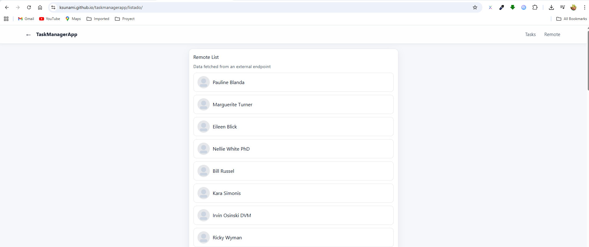
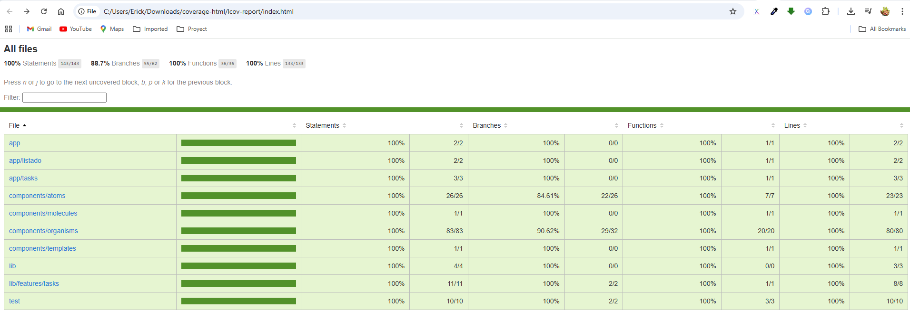

# TaskManagerApp

[](https://github.com/TU_USUARIO/taskmanagerapp/actions/workflows/test.yml)
[](https://github.com/TU_USUARIO/taskmanagerapp/actions/workflows/gh-pages.yml)

[](https://TU_USUARIO.github.io/taskmanagerapp/)

Aplicación **Next.js + TypeScript** con **Redux Toolkit** para gestionar tareas y una vista de **listado remoto**. Incluye **accesibilidad**, **pruebas unitarias** con Jest + React Testing Library, y **despliegue** como *static export* en **GitHub Pages**.

---

## 📸 Demo

- **Live:** https://TU_USUARIO.github.io/taskmanagerapp/
- **Capturas/GIFs** (colócalas en `public/preview/`):
  - Home  
    
  - Crear tarea (validaciones)  
    
  - Listado remoto (loading / error / fallback)  
    

---

## 🧩 Stack

- **Next.js 14** (App Router) + **TypeScript**
- **Redux Toolkit** + React-Redux
- **Jest** + **React Testing Library**
- **GitHub Actions** (tests y deploy)
- Despliegue **GitHub Pages** (static export)

---

## 🗂️ Estructura

```
src/
  app/
    page.tsx            # Home
    tasks/page.tsx      # Vista de tareas
    listado/page.tsx    # Vista remota
  components/
    atoms/              # Button, Input, Modal, Heading, Spinner...
    molecules/          # TaskItem
    organisms/          # TaskList, TaskFormModal, AppHeader, RemoteList
    templates/          # BasicLayout
  lib/
    store.ts
    features/tasks/
      tasksSlice.ts
  test/                 # setup y utilidades RTL (render con store)
public/preview/         # imágenes/GIFs para el README
```

---

## ⚙️ Puesta en marcha

```bash
npm install
npm run dev
# abre http://localhost:3000
```

---

## ✅ Pruebas

### Local

Scripts principales:

```json
{
  "scripts": {
    "test": "jest",
    "test:watch": "jest --watch",
    "test:cov": "jest --coverage"
  }
}
```

Ejecuta:

```bash
npm test
npm run test:watch
npm run test:cov
```

Cubrimos:
- **Redux** (acciones/estado)
- **TaskFormModal**: vacío, longitud máxima (80), duplicados, cancelar, enter/guardar, cierre por overlay
- **RemoteList**: loading, éxito, error HTTP, fallback de imagen
- **AppHeader**: back vs push('/') según historial
- **Páginas**: headings y CTAs

> Para un mínimo de cobertura, ajusta `coverageThreshold` en `jest.config.cjs`:
```js
coverageThreshold: {
  global: { statements: 80, branches: 80, functions: 80, lines: 80 }
}
```


### GitHub Actions (CI)

`.github/workflows/test.yml`:

```yaml
name: CI - Test
on:
  push:
  pull_request:
jobs:
  test:
    runs-on: ubuntu-latest
    steps:
      - uses: actions/checkout@v4
      - uses: actions/setup-node@v4
        with:
          node-version: 20
          cache: npm
      - run: npm ci
      - run: npm run test:cov
```



---

## 🚀 Despliegue a GitHub Pages

### 1) Configura Next para *static export*

`next.config.js` (ajusta el nombre del repo):

```js
const isProd = process.env.NODE_ENV === 'production';

module.exports = {
  output: 'export',               // genera /out
  images: { unoptimized: true },  // requerido en export estático
  trailingSlash: true,
  basePath: '/taskmanagerapp',    // ← NOMBRE EXACTO DEL REPO
  assetPrefix: isProd ? '/taskmanagerapp/' : '',
};
```

> Si publicas como **User/Org site** (`https://TU_USUARIO.github.io`), **elimina** `basePath` y `assetPrefix`.

### 2) Publicación rápida con `gh-pages`

`package.json`:

```json
{
  "scripts": {
    "build": "next build && next export",
    "predeploy": "npm run build",
    "deploy": "gh-pages -d out -b gh-pages"
  },
  "devDependencies": {
    "gh-pages": "^6.0.0"
  }
}
```

Sube el repo y deploy:

```bash
git init
git add .
git commit -m "chore: initial"
git branch -M main
git remote add origin https://github.com/TU_USUARIO/taskmanagerapp.git
git push -u origin main

npm run deploy
```

En **GitHub → Settings → Pages**:
- **Source**: *Deploy from a branch*
- **Branch**: `gh-pages` / `(root)`

La app quedará en:  
`https://TU_USUARIO.github.io/taskmanagerapp/`

### (Opcional) Deploy automático con Actions

`.github/workflows/gh-pages.yml`:

```yaml
name: Deploy to GitHub Pages
on:
  push:
    branches: [ main ]
permissions:
  contents: read
  pages: write
  id-token: write

jobs:
  build:
    runs-on: ubuntu-latest
    steps:
      - uses: actions/checkout@v4
      - uses: actions/setup-node@v4
        with:
          node-version: 20
          cache: npm
      - run: npm ci
      - run: npm run build
      - uses: actions/upload-pages-artifact@v3
        with:
          path: ./out

  deploy:
    needs: build
    runs-on: ubuntu-latest
    environment:
      name: github-pages
      url: ${{ steps.deployment.outputs.page_url }}
    steps:
      - id: deployment
        uses: actions/deploy-pages@v4
```

En **Settings → Pages** selecciona **Source: GitHub Actions**.

---

## 🧪 Consejos si no se ven estilos/JS en Pages

- Verifica que `basePath` y `assetPrefix` coincidan con el **nombre del repo**.
- Reconstruye tras cambios de `next.config.js`:
  ```bash
  npm run build && npm run deploy
  ```
- Para imágenes de Next en export estático, debe estar `images.unoptimized: true`.

---

## ♿ Accesibilidad

- Inputs con `label/for`.
- Estados de error con `role="alert"`, `aria-invalid`, `aria-describedby`.
- Navegación por teclado y foco visible.

---

## 📦 Scripts útiles

```bash
npm run dev       # desarrollo
npm run build     # producción + export estático
npm run test
npm run test:cov
npm run deploy    # gh-pages
```

---

## 🤝 Contribuir

1. Crea una rama `feat/...` o `fix/...`
2. `npm ci` y `npm run test:cov` antes de abrir PR
3. Verifica el build estático (`npm run build`)

---

## 📝 Licencia

MIT © ksunami
